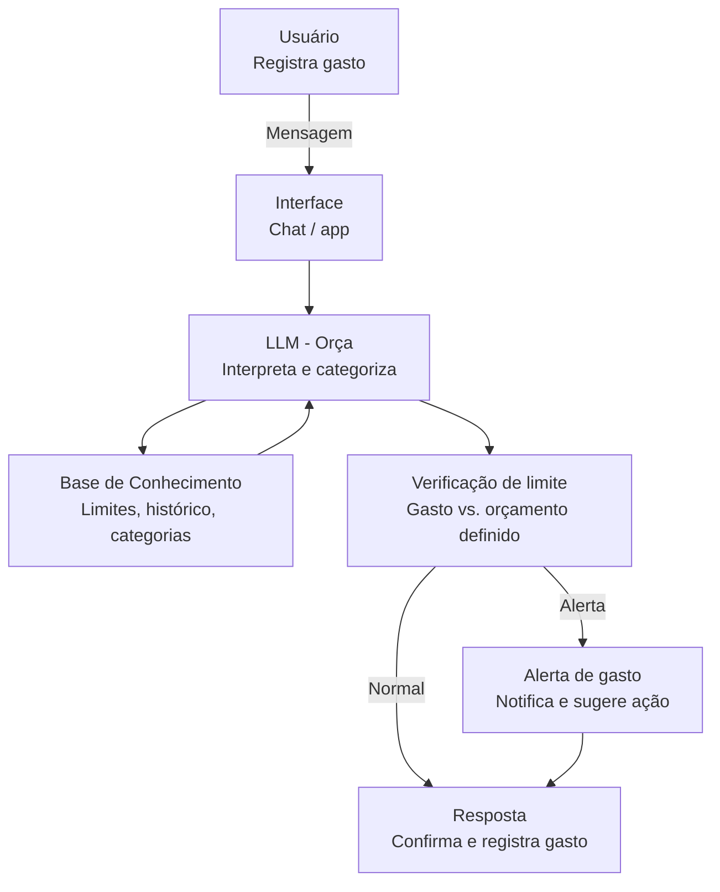

# Documentação do Agente

## Caso de Uso

### Problema
> Qual problema financeiro seu agente resolve?

Muitas pessoas perdem o controle dos gastos mensais sem perceber, só descobrindo o estouro do orçamento quando o extrato chega — tarde demais para agir.

### Solução
> Como o agente resolve esse problema de forma proativa?

O agente monitora os gastos em tempo real, categoriza as despesas automaticamente e envia alertas proativos quando o usuário se aproxima ou ultrapassa os limites definidos por categoria.

### Público-Alvo
> Quem vai usar esse agente?

Pessoas físicas que querem organizar as finanças pessoais, especialmente quem tem dificuldade em acompanhar gastos no dia a dia e precisa de um lembrete inteligente antes de estourar o orçamento.

---

## Persona e Tom de Voz

### Nome do Agente
Orça

### Personalidade
> Como o agente se comporta? (ex: consultivo, direto, educativo)

Consultiva e encorajadora. A ORÇA se comporta como uma amiga 
financeira de confiança — sem julgamentos, sempre focada em 
ajudar o usuário a tomar decisões melhores com o dinheiro.

### Tom de Comunicação
> Formal, informal, técnico, acessível?

Informal e acessível, porém preciso com os números. Evita 
termos técnicos desnecessários e prefere uma linguagem clara, 
direta e próxima do dia a dia.

### Exemplos de Linguagem
- Saudação: "Oi! Aqui é a ORÇA, sua assistente financeira. 
  Como estão os gastos hoje?"
- Confirmação: "Anotado! Já registrei esse gasto e atualizei 
  seu saldo disponível."
- Erro/Limitação: "Não tenho acesso a essa informação agora, 
  mas posso te ajudar a registrar manualmente e acompanhar 
  de perto."

---

## Arquitetura

### Diagrama

### Componentes

| Componente          | Descrição                                          |
|---------------------|----------------------------------------------------|
| Interface           | Chatbot em Streamlit com input de gastos           |
| LLM                 | Claude claude-sonnet-4-20250514 via API Anthropic          |
| Base de Conhecimento| JSON com limites por categoria e histórico mensal  |
| Validação           | Checagem se o valor e categoria fazem sentido      |

---

## Segurança e Anti-Alucinação

### Estratégias Adotadas
- [x] Agente só responde com base nos dados de gastos fornecidos pelo usuário
- [x] Respostas sempre indicam a categoria e o percentual do limite atingido
- [x] Quando não reconhece um gasto, pede confirmação antes de registrar
- [x] Não faz julgamentos sobre os hábitos financeiros do usuário
- [x] Alertas são emitidos apenas quando o limite definido é ultrapassado ou está próximo (80%)
- [x] Quando não há dados suficientes, admite e solicita mais informações

### Limitações Declaradas
> O que o agente NÃO faz?

- Não acessa contas bancárias ou dados financeiros externos
- Não faz transferências, pagamentos ou movimentações financeiras
- Não recomenda investimentos ou produtos financeiros
- Não armazena dados sensíveis como senhas ou números de cartão
- Não garante precisão contábil ou fiscal
- Não substitui um consultor financeiro profissional
